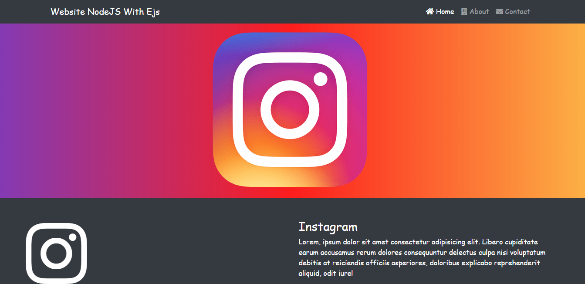

# Website con NodeJS y el motor de plantillas EJS
Aplicación estática basica usando NodeJS.

Tecnologías:
- NodeJS.

Módulos:
- Framework: `npm i express`.
- Visualiza por consola las peticiones que van llegando por servidor `npm i morgan`.
- Reinicia el servidor automaticamente al guardar cambios `npm i nodemon -D`.
- Motor de plantillas `npm i ejs`.

Esta app puede:
- Navegar en las diferentes páginas estaticas(Home, About y Contact).
- Permite a un usuario visualizar contenido estático.

# Screenshot

# Guía de instalación
1. Descarga el repositorio.
2. Descomprime la carpeta dentro del directorio que desees.
3. Renombra la carpeta (Opcional).
4. Entra a la carpeta desde la terminal `cd directorio/de/la/carpeta`.
8. Ejecuta `npm install`.
9. Ejecuta `npm run dev`.
10. Abre la aplicación en el navegador con `http://localhost:3000`.
11. Ya puedes comenzar a utilizar la aplicación.

# License

#### Todos los proyectos creados por Alex Ku Dzul están bajo la [licencia MIT](https://opensource.org/licenses/MIT).